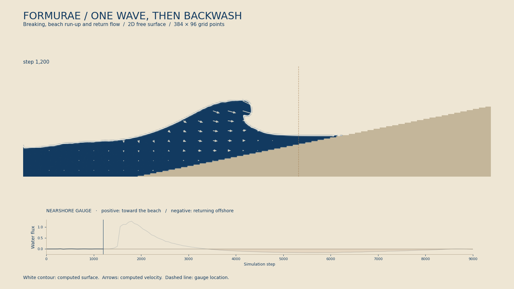

# 巻き込む波の試作

北斎の『神奈川沖浪裏』に見られる，波頭が前へせり出す形を目標にした，
横から見た二次元の水槽である．水と空気の境界を追跡するため，水面が上下に
重なる形も表現できる．



[動画（8.4 秒）](results/breaking-wave.mp4) · [時間変化の一覧](results/sequence.png)

512 × 192 点で 3,000 ステップ計算し，波頭が前へせり出して下へ曲がる動きを確認した．
輪郭の細い白線は計算された水面を示す．北斎の絵のように枝分かれした白波や飛沫は
この二次元の試作には含まない．

| 検査 | 波の計算（3,000 ステップ） | 静水（1,200 ステップ） |
| --- | ---: | ---: |
| 水量の最大相対変化 | 1.33 × 10⁻¹⁴ | 9.49 × 10⁻¹⁵ |
| 1 点あたりの未配分質量の最大絶対値 | 2.89 × 10⁻¹³ | 1.21 × 10⁻¹³ |
| 覆いかぶさる水面の点数の最大値 | 32 | 0 |

検査の値は [verification.json](results/verification.json)，全記録は
[stats.csv](results/stats.csv)，実行条件とソースのハッシュは
[metadata.json](results/metadata.json) に保存した．水面の点数の定義は後述する．
これは水量保存と動作の検査であり，実験値との比較や格子を細かくしたときの誤差の評価は
まだ行っていない．

## 実行

リポジトリ直下で次を実行する．

```sh
make breaking-wave-demo
```

`run.py` は `.fme → Egison → FEIR → .fmr → Formura → C` の順に生成する．
FEIR は Formurae の中間表現である．
計算結果を `.build/breaking_wave/demo/` に保存する．`render.py` は保存済みの
水の占有率（各格子点を水が占める割合）を描画し，`results/sequence.png` と
`results/breaking-wave.mp4` を作る．標準のコマンドは，1,980 ステップの
静止画 `results/wave.png` も保存する．
白い線は占有率 0.5 の等高線であり，描画で飛沫や巻き込みを付け加えない．

初期条件，海底と壁，重力，流体の更新，水面の移動，水量の受け渡し，
検証用の場はすべて `breaking_wave.fme` にある．C は生成された関数の呼び出し，
出力，検査のみを行い，Python はビルド・起動・ファイル操作・描画のみを行う．
Formura 本体の変更や外部の流体ソルバーは使わない．

空間の次元と分布の成分数は，次のように別々に指定する．

```text
dimension 2
axes x, y
index a : 9
field f_a
field savedG_a
field savedS_a
```

`f_a` は9種類の移動速度に対応する分布，`savedG_a` と `savedS_a` はそれぞれ
衝突後と移動後の分布を保存する場である．`f_1` は静止成分，`f_2`〜`f_9` は
周囲8方向の成分を表す．流速 `u_i` は空間の次元に従い2成分となる．
密度と流速は，縮約（同じ上下の添字について成分の和を取る演算）で求める．

```text
local rho = ones~a . f_a
local u_i = (directions~a_i . f_a)/rho - [| 0,gravity/2 |]_i
```

`ones` は9個の1，`directions` は9×2成分の速度の表である．重力の項は，
時間刻みの半分に相当する速度の補正を鉛直成分に加える．

添字宣言への移行では，生成された初期化・中間計算・更新の296式と，パラメータ・
型・関数の入出力が，成分名と宣言・代入の並び順を除いて移行前と一致することを確認した．
512×192点の60ステップでも，記録した検証値と描画用データが完全に一致した．
[移行の検証記録](results/index-migration.json) に両ソースのハッシュと比較結果を保存した．
掲載動画と3,000ステップの数値は移行前の実行結果を使い，
[metadata.json](results/metadata.json) にはそのソースと等価な添字宣言版のハッシュを併記する．

物理的な 1 ステップは，衝突，移動，分類，質量再配分，診断の 5 回の
`step` で実行する．中間結果を通常の `field` に保存することで，一つの巨大な式へ
展開されることを避けている．CSV・動画・コマンドの `--steps` は物理的な
ステップ数を表す．途中の段階では描画しない．

標準の設定は 512 × 192 点，平水面の高さ 72（水平な底部は高さ 2），初期波高 52.5，重力加速度
0.00006666666666666667，`tau = 0.68` である．初期の右向き速度は
`2.5*sqrt(gravity*(depth+amplitude))*elevation/height` とする．
`elevation` は平水面からの盛り上がり，`height = depth + elevation` は水面の高さである．
波の形と流速は指定した初期条件であり，通常の海の波が自然に発生する過程から
計算したものではない．この水槽で波頭が巻き込む条件を調べる実験である．

```sh
# 水量保存・計算値の範囲・巻き込みの指標を検査し，静水の試験も実行する
python3 examples/breaking_wave/verify.py --require-overhang --still-water
```

より小さい計算で形を確認するには，次の条件を使える．

```sh
python3 examples/breaking_wave/run.py --grid 256 128 --steps 1400 --every 20 \
  --param depth=48 --param amplitude=35 --param center=70 --param width=24 \
  --param beachStart=120 --param beachSlope=0.2 --param gravity=0.0001 \
  --param launch=2.5 --param tau=0.62 --output .build/breaking_wave/coarse
python3 examples/breaking_wave/render.py .build/breaking_wave/coarse \
  --output .build/breaking_wave/coarse/figures
```

この小さい水槽では，長く計算すると波が右端の壁に達する．標準の水槽は，
波の周辺の格子を 1.5 倍に細かくし，さらに右側を延長している．

## 計算法

格子ボルツマン法（格子点間を移動する分布から流れを求める方法）の
二次元・九速度モデル D2Q9 を用いる．格子間隔と時間刻みを 1 とする単位系で，
分布を平衡状態へ近づける速さを決める緩和時間 `tau` と，流れの粘性を表す
動粘性係数の関係は `ν = (tau - 0.5)/3` である．
重力は [Guo・Zheng・Shi の力の項](https://doi.org/10.1103/PhysRevE.65.046308)
として与える．静水圧（水深とともに増える圧力）に対応する密度と，局所的に
盛り上がった水面，右向きの速度を初期条件にする．この初期波は厳密な進行波解ではない．

水面の処理は [Thürey の自由表面法](https://www10.cs.fau.de/publications/dissertations/Diss_2007-Thuerey.pdf)
を基にする．自由表面とは，ここでは水と一定圧力の空気との境界である．

1. 各点を空気・水面・水・固体に分類し，分布と水の質量を保持する．
2. 分布を緩和させ，重力を加え，隣接点から移動させる．固体では反射させ，
   空気から来るはずの分布は一定の気圧の条件から再構成する．
3. 隣接点との流束（点の間を出入りする質量）を対称に計算して質量を更新する．
   水面同士では両点の占有率の平均を使う．
4. 満ちた水面点は水へ，空になった水面点は空気へ変換する．水と空気が直接隣接しないように，
   その間の水面点を同時に作る．新たな水面点の分布は近傍の水の状態から初期化する．
   近傍に空気がない満水の点と，近傍に水がないほぼ空の点も分類を更新する．
   これにより，水を含まない水面点が残って加速し続けることを防ぐ．
5. 分類変更による余剰・不足の質量を近傍の水面点へ均等に配る．受け取り先のない量は
   `bank` に保存し，受け取り先ができた時点で渡す．捨てたり全領域へ補正したりしない．

`water = mass + bank` の総和を，Formura の集約演算（格子全体の和や最大値を求める操作）で測る．`bank` の最大絶対値も
記録するため，保存量だけが合って水量が実際の水面から失われる状態を見落とさない．
`overhang` は「占有率が 0.5 を超え，直下は 0.5 未満で固体でもない点」の数であり，
水面が覆いかぶさる形の補助的な指標である．離れた水滴も数えるため，動画と併せて判断する．

## 適用範囲

空気の流れ・気泡の圧縮・表面張力はこの試作には含まない．海底は格子に沿った
階段状の固体である．三次元の飛沫や白い泡の再現，実海域に対する定量予測は
この二次元モデルの検証とは別の課題である．複数プロセスによる分割と
複数時間ステップをまとめる最適化は，この例ではまだ検証していない．
