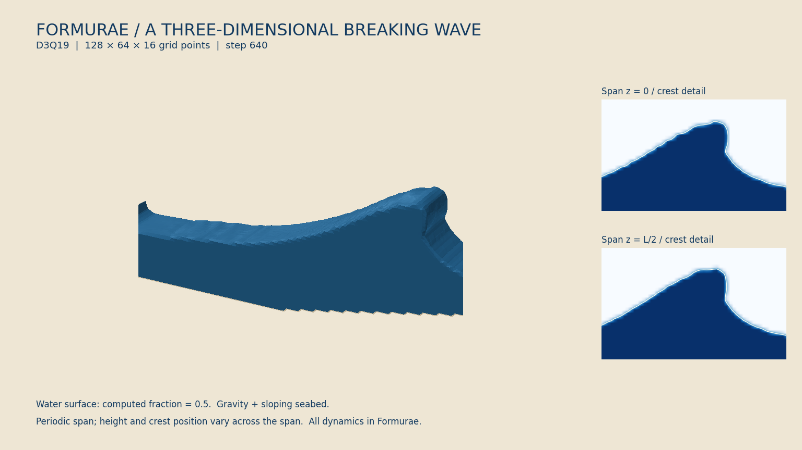

# 三次元で巻き込む波

D3Q19（3次元空間・19種類の移動速度）の格子ボルツマン法で，水面が前へせり出す
水槽を計算する．格子ボルツマン法は，格子点間を移動する分布から流れを求める方法である．
x は波の進行方向，y は鉛直方向，z は奥行き方向とする．
奥行き方向の波高と波の位置を正弦波状に変え，奥行き方向にも流れが生じる初期条件を使う．
北斎の『神奈川沖浪裏』のような波頭の巻き込みを目標にした試作である．



[動画（7.8秒）](results/breaking-wave3d.mp4)

128×64×16点で760ステップ計算し，波頭が立ち上がって先端が前へせり出す形を確認した．
この粗い格子での巻き込みは小さく，大きな空洞や北斎の絵の細かな白波までは再現していない．

分布は `index a : 19` と `field f_a` で宣言する．19×3成分の速度の表と分布の縮約
（同じ添字の成分について和を取る演算）から密度と3成分の流速を求める．
水面は各格子点の水の占有率で表し，波頭の下側へ回り込む面も保持する．

## 実行

```sh
python3 examples/breaking_wave3d/run.py
python3 examples/breaking_wave3d/verify.py --require-overhang --reference-cases
```

動画の描画には NumPy・Matplotlib・scikit-image と ffmpeg を使う．
scikit-image の marching cubes は，保存された水の占有率が0.5になる面を三角形へ変換する描画処理である．

```sh
python3 -m venv --system-site-packages .build/breaking_wave3d/render-env
.build/breaking_wave3d/render-env/bin/python -m pip install -r examples/breaking_wave3d/requirements-render.txt
.build/breaking_wave3d/render-env/bin/python examples/breaking_wave3d/render.py
```

依存ライブラリを準備したあとは，次でも計算と描画を実行できる．

```sh
make breaking-wave3d-demo WAVE3D_PYTHON=.build/breaking_wave3d/render-env/bin/python
```

検証は `make breaking-wave3d-verify` で実行できる．

計算結果は `.build/breaking_wave3d/demo/`，図と動画はこのディレクトリの `results/` に保存する．
`run.py --grid NX NY NZ --steps N --every M --output DIRECTORY` で実行条件を指定できる．
`--param ripple=0 --param bend=0` とすると，奥行き方向に同一の初期条件になる．

標準の設定は128×64×16点，760ステップである．格子間隔と1回の物理的な時間刻みを1とする．
平水面の高さは24，波の盛り上がりの高さは17.5，重力加速度は0.0002，
分布を平衡状態へ近づける速さを決める緩和時間は `tau = 0.62` とする．
奥行き方向の波高の変化は±6%，波の位置の変化は±2格子である．
初期の右向き速度は `2.5*sqrt(gravity*(depth+amplitude))*elevation/height` とする．
これは指定した盛り上がりと流速から出発する水槽の計算で，厳密な進行波解ではない．

## 計算の分担と水面の処理

初期条件・固定した海底と壁・重力・流体の更新・水面の移動・質量の受け渡し・
診断用の場は，すべて [breaking_wave3d.fme](breaking_wave3d.fme) に記述する．
通常の `.fme → Egison → FEIR → .fmr → Formura → C` の経路で実行し，
Formura 本体には変更を加えない．C は生成関数の呼び出しと結果出力，Python は
ビルド・起動・検査結果の比較・描画だけを担当する．

二次元の [breaking_wave](../breaking_wave/README.md) と同じ自由表面法
（水と一定圧力の空気との境界を追跡する方法）を，D3Q19 の18近傍へ拡張する．
1回の物理的な時間更新は次の5段階である．

1. 分布を平衡状態へ近づけ，重力を加える．
2. 隣接格子点から分布を移し，水の質量を交換する．壁では反射し，空気側では気圧条件から分布を補う．
3. 空気・水面・水の分類を更新し，新しい水面点の流れを近傍の値から初期化する．
4. 分類変更による過不足の質量を近傍の水面点に配る．受け取り先のない量は `bank` に保持する．
5. 更新後の状態から，水量・流速・水面の覆いかぶさり・奥行き方向の変化を測る．

各段階の値を通常の `field` に保存し，5回の生成された `step` を1物理ステップとして数える．
波は指定した盛り上がりと初期流速から作る．奥行き方向の境界は周期的，
x方向の両端と底・上端には固定壁を置く．海底は格子に沿った階段状である．

近傍への移動は，中心1階・2階差分の恒等式で正確な1セル移動を作る．
斜め方向は中間値を `local` に保存してから次の座標方向へ移す．
成分ごとに異なる条件分岐は，成分を選んでから評価してテンソルへまとめる．
これにより，テンソルを引数にした条件分岐の組合せが変換中に大きくなることを避ける．

## 検証と適用範囲

| 検査 | 三次元の波（760ステップ） | 静水（400ステップ） | 奥行き方向に一様な波（200ステップ） |
| --- | ---: | ---: | ---: |
| 水量の最大相対変化 | 2.23×10⁻¹⁴ | 2.08×10⁻¹⁴ | 3.55×10⁻¹⁴ |
| 1点あたりの未配分質量の最大絶対値 | 9.44×10⁻¹⁴ | 5.77×10⁻¹⁴ | 3.02×10⁻¹⁴ |
| 覆いかぶさる水面の点数の最大値 | 16 | 0 | 0 |
| 最大流速 | 0.1489 | 0.000329 | 0.05356 |
| 奥行き方向の最大流速 | 0.01880 | 3.26×10⁻¹⁶ | 2.22×10⁻¹⁶ |
| 奥行き方向の隣接点の占有率の差の最大絶対値 | 0.9814 | 0 | 0 |

数値は20ステップごとの記録から求めた．静水と一様な波の試験は80×56×12点を使う．
結果は [verification.json](results/verification.json)，本計算の記録は
[stats.csv](results/stats.csv)，実行条件とソースのSHA-256ハッシュは
[metadata.json](results/metadata.json) に保存した．静水と一様な波の記録は，それぞれ
[still-stats.csv](results/still-stats.csv) と [planar-stats.csv](results/planar-stats.csv)，
実行条件は [still-metadata.json](results/still-metadata.json) と
[planar-metadata.json](results/planar-metadata.json) にある．
今回の本計算はコード変換と描画を除いて約548秒かかった（[実行ログ](results/run.log)）．

`water = mass + bank` の総和，未配分質量の最大絶対値，密度の範囲，最大流速を記録する．
`overhang` は水が半分以上を占め，直下に水と固体がない格子点の数である．
離れた水滴も数えるため，立体図と断面図を併せて判断する．
`spanVelocity` は奥行き方向の流速，`spanDifference` は奥行き方向に隣り合う点の占有率の差である．
これらも Formurae で求め，3次元の変化が発生していることを確認する．

静水の試験では流速の増大や覆いかぶさりがないことを確認する．
奥行き方向に同一の初期条件から出発する試験では，その対称性が保たれることを確認する．
実験との比較と格子を細かくしたときの誤差評価はまだ行っていない．
空気の流れ・気泡の圧縮・表面張力・細かな白い泡は含まない．
MPI による領域分割と時間方向のブロッキングは，この例では未検証である．

図の立体部分は，保存した占有率0.5の面と，奥行き方向の両端で切った断面を描く．
右側には奥行きの異なる2か所の断面を，波頭付近を拡大して併記する．
標準の静止画は，記録した `overhang` が最大になる最初の640ステップを選ぶ．
`--snapshot-step N` で変更できる．描画で巻き込みや泡を加えない．
