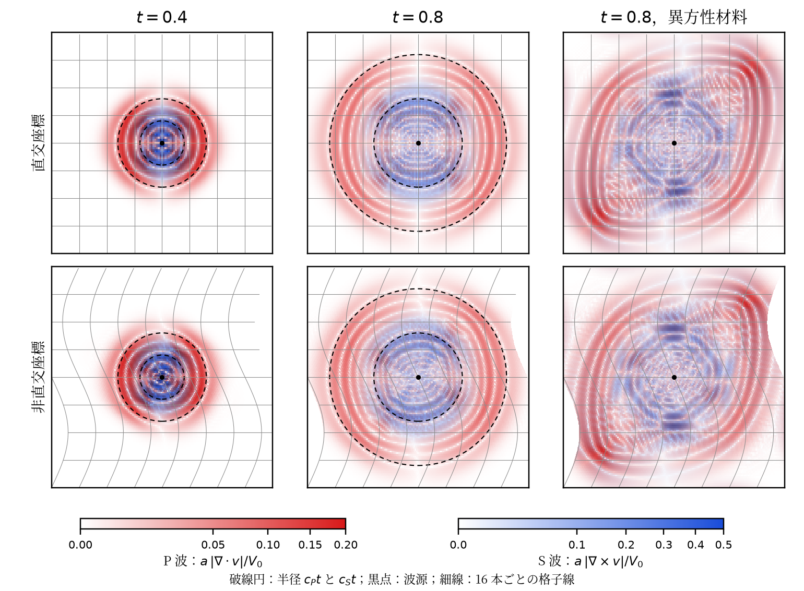

# 周期領域の弾性波：同じプログラムを二つの座標系で

線形弾性体の波（速度と応力の時間発展）を，一辺 4 の周期立方体で計算する．
同じプログラムを，直交座標と，同じ立方体の非直交座標
（格子線が横に波打つ座標系）で実行し，両方で P 波（縦波，体積変化を伴う）と
S 波（横波，ずれの波）が分離して広がることを確かめる．
$\lambda=2$，$\mu=\rho_0=1$ なので P 波の速さは 2，S 波の速さは 1 である．



[数値検証結果](results/verification.json) ／ [実行記録](results/runs.json)

## 数式とテンソル記法

速度 $v^i$，対称な応力 $\sigma^{ij}$，計量 $g_{ij}$，$J=\sqrt{\det g}$ に対して

\[
e_{ij}=\tfrac12\bigl(g_{ik}\partial_jv^k+g_{jk}\partial_iv^k+(\partial_kg_{ij})v^k\bigr),\qquad
(\mathcal D\sigma)^i=\frac{g^{ik}}{J}\partial_j(Jg_{k\ell}\sigma^{\ell j})-\tfrac12g^{ik}(\partial_kg_{j\ell})\sigma^{j\ell}
\]

がひずみ速度と応力の発散，$\mathcal C(e)^{ij}=\lambda g^{ij}g^{k\ell}e_{k\ell}+2\mu g^{ik}g^{j\ell}e_{k\ell}$ が
等方な構成則である．$\partial_tv=\mathcal D\sigma/\rho_0$，$\partial_t\sigma=\mathcal C(e(v))$ を
速度 Verlet 法（速度半ステップ・応力 1 ステップ・速度半ステップ）で進める．

座標 $(x,y,z)$ は物理位置 $(x+s\sin(2\pi y/L),\,y,\,z)$ に写す．$s=0$ が直交座標，
$s>0$ が非直交座標で，どちらも三方向とも周期である．計量は成分で宣言する．

```
metric tensor [[1, c, 0], [c, 1 + c^2, 0], [0, 0, 1]]    -- c = s (2π/L) cos(2π y/L)
metric volume 1
```

計量・逆計量・計量の解析微分は Egison が宣言から導き，`init` で係数場
（`GD`，`GU`，`DG1`〜`DG3`，`J`）に凍結する．`step` は場と定数だけを読むので，
Formura の時間方向のブロッキングと MPI 分割がそのまま使える．三つの演算子は
係数場を参照する関数として一度だけ書く．

```
def strain V~a = withSymbols [i, j, k] ((GD_i_k . ∂_j V~k + GD_j_k . ∂_i V~k + DG1_i_j * V~1 + DG2_i_j * V~2 + DG3_i_j * V~3) / 2)
def stressRate E_i_j = withSymbols [i, j, k, l] (λ * GU~i~j * (GU~k~l . E_k_l) + 2 * μ * (GU~i~k . GU~j~l . E_k_l))
def stressDiv S~a~b = withSymbols [i, j, k, l] ((GU~i~k . ∂_j (J * (GD_k_l . S~l~j))) / J - (GU~i~1 * (DG1_j_l . S~j~l) + GU~i~2 * (DG2_j_l . S~j~l) + GU~i~3 * (DG3_j_l . S~j~l)) / 2)
```

`elastic_pulse_anisotropic.fme` は `stressRate` に
$\alpha n^in^jn^kn^\ell e_{k\ell}$ の 1 項を足しただけの変種で，
物理方向 $n=(1,1,0)/\sqrt2$ に沿って材料を硬くする（$\alpha=3$）．
$n$ の座標成分は場 `NV` に凍結する．

## 検証量はすべて `.fme` の場

- P 波の指標 `compression` $=J^{-1}\partial_i(Jv^i)$，S 波の指標 `shearing`
  $=\sqrt{g_{ij}\omega^i\omega^j}$（$\omega^i=J^{-1}\varepsilon^{ijk}\partial_j(g_{k\ell}v^\ell)$）．
- 弾性エネルギー `energy` と，Verlet 法が丸め誤差の範囲で保存する修正エネルギー `modified`
  （エネルギーから $\Delta t^2$ に比例する力の 2 乗の補正を引いたもの）．
- 各指標について，無次元化した指標 $a\,p/V_0$ が $0.01$ を超える最も遠い点の
  波源からの物理距離 `pfront`，`sfront`（`max` の reduction で取る）．これが各殻の
  外側の半径で，時間に対する傾きが波速になる（初期値が有限の台を持つので，
  殻の外縁は厳密に波速で進む）．
- 各指標の 2 乗と物理距離を掛けたモーメント `pw`，`pr`，`sw`，`sr`（平均半径の記録用）．
- 精度検査（`plane.fme.inc`，`verify.py` が差し込む）：物理 $X$ 方向に進む平面 P 波・S 波の
  厳密解を各座標系の反変成分に変換して `init` に置き，時刻 $T$ の厳密解との差の 2 乗和
  `err` と参照ノルム `ref` を `step` で計算する．

総和は Formura の `reduces:` で取る．C ドライバ（`driver.c`）は生成プログラムの起動，
総和の書き出し，断面と全状態の書き出しだけを行う．描画は `render.py`（保存結果の
物理座標への写像と色付けのみ）．

## 結果（`results/verification.json`，`results/runs.json`）

| 検査 | 直交座標 | 非直交座標 |
|---|---|---|
| ブロッキング（4 ステップ）と通常版の全状態の最大差（48³，40 ステップ） | 0 | 0 |
| MPI 2 プロセス（x 分割・y 分割）と通常版の最大差 | 0，0 | 0，0 |
| 平面 P 波の相対誤差 $N=16,32,64$（$t=1$） | 0.61，0.16，0.040（次数 1.95，1.99） | 0.61，0.16，0.040（1.95，1.99） |
| 平面 S 波の相対誤差 $N=16,32,64$ | 0.31，0.080，0.020（1.96，1.99） | 0.32，0.082，0.021（1.96，1.99） |
| 波面の速さ $c_P$，$c_S$（128³，$0.3\le t\le0.7$） | 1.86，0.96 | 1.86，0.95 |
| 同（64³） | 1.65，0.84 | 1.72，0.84 |
| 通常エネルギーの範囲 $[\min E,\max E]/E_0$（128³，256 ステップ） | $[0.99975, 1]$ | $[0.99975, 1]$ |
| 修正エネルギーの相対ドリフト（128³，256 ステップ） | $3.9\times10^{-13}$ | $4.0\times10^{-13}$ |
| 二座標系の波面半径の最大差（128³） | P 0.0013，S 0.0067（格子幅 0.031） | |

- 生成した Formura ソースは，直交座標と非直交座標で `double :: shear` の行だけが異なる
  （パラメータは Egison を記号のまま通るので，同じソースの正規化は 1 回で済み，
  `run.py` は生成 Formura ソースのパラメータ行を書き換えて各設定を作る）．
- 波面の速さが厳密値 2，1 より小さいのは，パルスの縁（パルス半径あたり 8 セルの上で
  最も短い波長を含む）を中心差分が遅く伝えることと，減衰する波面に対して固定閾値が
  遅れることによる．生成された更新式の精度は平面波の検査（2 次収束）で測る．
- 異方性の変種（$\alpha=3$）は等方版と `stressRate` の 1 行だけが異なる（`verify.py` が確認）．

## 再現

```
python3 examples/elastic_pulse/verify.py        # 数値検証（results/verification.json）
python3 examples/elastic_pulse/run.py --fresh --blocking 0 --mpi 1 2 1      # 128^3 のデモ（直交・非直交）
python3 examples/elastic_pulse/run.py --fresh --blocking 0 --mpi 1 2 1 --source elastic_pulse_anisotropic.fme
python3 examples/elastic_pulse/render.py        # 図と実行記録（results/）
```

デモは 128³・256 ステップ（$t=0.8$）で，時間方向のブロッキングなし・2 プロセスの
MPI 分割で実行する（ブロッキング版と単一プロセス版は静的配列が 2 GB を超え，
macOS のローダが実行ファイルを読み込めない）．ブロッキングと MPI が通常の生成物を
厳密に再現することは `verify.py` が 48³ で確かめる．

`make elastic_pulse` は 48³ の設定（`elastic_pulse.yaml`）で通常のコード生成経路を通し，
ドライバを 40 ステップ実行する．MPI の検証には `mpicc`，`mpirun` を使う
（このマシンでは `HWLOC_SYNTHETIC='node:1 core:10 pu:1'`，`MPIRUN_ARGS='--bind-to none'`）．
