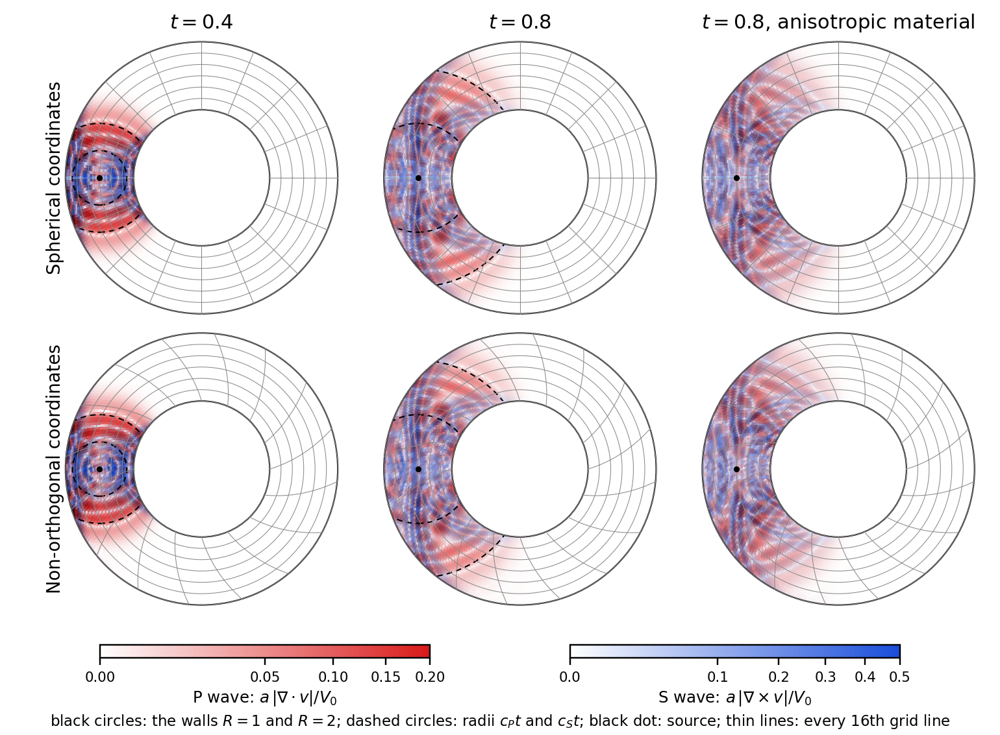

# 壁のある球殻の弾性波：同じプログラムを二つの座標系で

線形弾性体の波（速度と応力の時間発展）を，球面 $R=1$ と $R=2$ の間で余緯度
$\arctan 2$ と $\pi-\arctan 2$ の二つの円錐に挟まれた，赤道を取り巻く帯状の球殻で計算する．
壁はすべて剛体（速度を 0 に保つ）で，経度は周期的である．
同じプログラムを，球座標と，同じ球殻の非直交座標
（経度が半径とともに巻く座標系）で実行し，両方で P 波（縦波）と S 波（横波）が
分離して広がり，壁で反射することを確かめる．
$\lambda=2$，$\mu=\rho_0=1$ なので P 波の速さは 2，S 波の速さは 1 である．



[数値検証結果](results/verification.json) ／ [実行記録](results/runs.json)

## 数式とテンソル記法

速度 $v^i$，対称な応力 $\sigma^{ij}$，計量 $g_{ij}$，$J=\sqrt{\det g}$ に対して

\[
e_{ij}=\tfrac12\bigl(g_{ik}\partial_jv^k+g_{jk}\partial_iv^k+(\partial_kg_{ij})v^k\bigr),\qquad
\nabla_j\sigma^{ij}=\frac{g^{ik}}{J}\partial_j(Jg_{k\ell}\sigma^{\ell j})-\tfrac12g^{ik}(\partial_kg_{j\ell})\sigma^{j\ell}
\]

がひずみ速度（共変な速度勾配の対称部分）と応力の共変発散，
$\partial_t\sigma^{ij}=C^{ijk\ell}e_{k\ell}$，$C^{ijk\ell}=\lambda g^{ij}g^{k\ell}+\mu(g^{ik}g^{j\ell}+g^{i\ell}g^{jk})$ が
等方な構成則（速度形の Hooke 則）である．$\rho_0\partial_tv^i=\nabla_j\sigma^{ij}$，$\partial_t\sigma^{ij}=C^{ijk\ell}e_{k\ell}(v)$ を
速度 Verlet 法（速度半ステップ・応力 1 ステップ・速度半ステップ）で進める．

座標は半径 $r$，余緯度 $\theta$，および経度 $\Phi=\varphi+s(r-1)$ に写される $\varphi$ である．
`origin r = 1.0` と `origin θ = 1.1071487177940906`（$\arctan 2$）が最初の格子点の座標値を与えるので，
$r$ と $\theta$ は半径と余緯度そのものである（`1 + r` のようなずれた多項式を Egison が展開せずに
済み，生成物が小さくなる）．$s=0$ が球座標，$s>0$ が非直交座標で，計量は成分で宣言する．

```
metric tensor [[1 + (twist * r * sin θ)^2, 0, twist * (r * sin θ)^2], [0, r^2, 0], [twist * (r * sin θ)^2, 0, (r * sin θ)^2]]
metric volume r^2 * sin θ
```

計量 `g_i_j`，逆計量 `g~i~j`，体積要素 `volume`，計量の解析微分
`∂/∂ g_i_j coordinates~k` は宣言から Egison が導き，三つの演算子はそれらを
その場で使う関数として一度だけ書く．

```
def strain V~a = withSymbols [i, j, k] ((g_i_k . ∂_j V~k + g_j_k . ∂_i V~k + (∂/∂ g_i_j coordinates~k) . V~k) / 2)
def stressRate E_i_j = withSymbols [i, j, k, l] (λ * g~i~j * (g~k~l . E_k_l) + 2 * μ * (g~i~k . g~j~l . E_k_l))
def stressDiv S~a~b = withSymbols [i, j, k, l] ((g~i~k . ∂_j (volume * (g_k_l . S~l~j))) / volume - (g~i~k . (∂/∂ g_j_l coordinates~k) . S~j~l) / 2)
```

## 壁

`boundary r : sbp`，`boundary θ : sbp` が有界な二つの軸に総和部分積分（SBP）の差分を
要求する．この宣言が供給する定数 `sbpLoR`，`sbpHiR`，`sbpLoTheta`，`sbpHiTheta` は壁の格子点を
示し，step のマスク `vm` はそこで速度を 0 に保つ．力もマスクしてから速度に加えるので，
1 ステップは内部の状態のシンプレクティックな写像であり，修正エネルギーは丸め誤差の範囲で
保存される．エネルギーと誤差の総和には SBP のノルム（壁の格子点で重み 1/2）を使う．

`elastic_shell_anisotropic.fme` は `stressRate` に
$\alpha n^in^jn^kn^\ell e_{k\ell}$ の 1 項を足した変種で，
物理的な半径方向 $n=e_R$ に沿って材料を硬くする（$\alpha=3$）．
$n$ の座標成分は定義 `direction` として書く（非直交座標では $e_R$ に経度成分 $-s$ が付く）．

## 検証量はすべて `.fme` の場

- P 波の指標 `compression` $=J^{-1}\partial_i(Jv^i)$，S 波の指標 `shearing`
  $=\sqrt{g_{ij}\omega^i\omega^j}$（$\omega^i=J^{-1}\varepsilon^{ijk}\partial_j(g_{k\ell}v^\ell)$）．
- 弾性エネルギー `energy` と，Verlet 法が丸め誤差の範囲で保存する修正エネルギー `modified`
  （エネルギーから，壁でマスクした力の 2 乗に $\Delta t^2$ を掛けた補正を引いたもの）．
- 各指標について，無次元化した指標 $a\,p/V_0$ が $0.01$ を超える最も遠い点の
  波源からの物理距離 `pfront`，`sfront`（`max` の reduction で取る）．波源からの直接の波面は
  壁に達した後も球面のまま球殻の中に残るので，その最大距離は波速で伸びる．
- 各指標の 2 乗と物理距離を掛けたモーメント `pw`，`pr`，`sw`，`sr`（平均半径の記録用）．
- 精度検査（`bessel.fme.inc`，`verify.py` が差し込む）：ねじれ振動の厳密なモード
  （速度は経度方向，角度部分は $P_3^1(\cos\theta)$ で二つの円錐上で 0，動径部分は 3 次の
  球 Bessel 関数の組み合わせで二つの球面上で 0）を各座標系の反変成分に変換して `init` に置き，
  時刻 $T$ の厳密解との差の 2 乗和 `err` と参照ノルム `ref` を `step` で計算する．

総和は Formura の `reduces:` で取る．C ドライバ（`driver.c`）は生成プログラムの起動，
総和の書き出し，赤道面の断面と全状態の書き出しだけを行う．描画は `render.py`（保存結果の
物理座標への写像と色付けのみ）．

## 結果（`results/verification.json`，`results/runs.json`）

RESULTS_TABLE

## 再現

```
python3 examples/elastic_shell/verify.py        # 数値検証（results/verification.json）
make elastic_shell-demo                         # 97×65×256 のデモ（球座標・非直交，等方・異方性）
python3 examples/elastic_shell/render.py        # 図と実行記録（results/）
```

デモは半径 97 点・余緯度 65 点・経度 256 セルの格子で 1536 ステップ（$t=0.8$）を，
時間方向のブロッキング（間隔 4）と 10 プロセス（余緯度を 5 分割，経度を 2 分割）で実行する．
ブロッキングと MPI（壁のある軸の分割を含む）が通常の生成物を厳密に再現することは
`verify.py` が $36\times36\times48$ で確かめる．

`make elastic_shell` は $33\times33\times64$ の設定（`elastic_shell.yaml`）で通常のコード生成経路を通し，
ドライバを 40 ステップ実行する．MPI の検証には `mpicc`，`mpirun` を使う
（このマシンでは `HWLOC_SYNTHETIC='node:1 core:10 pu:1'`，`MPIRUN_ARGS='--bind-to none'`）．
