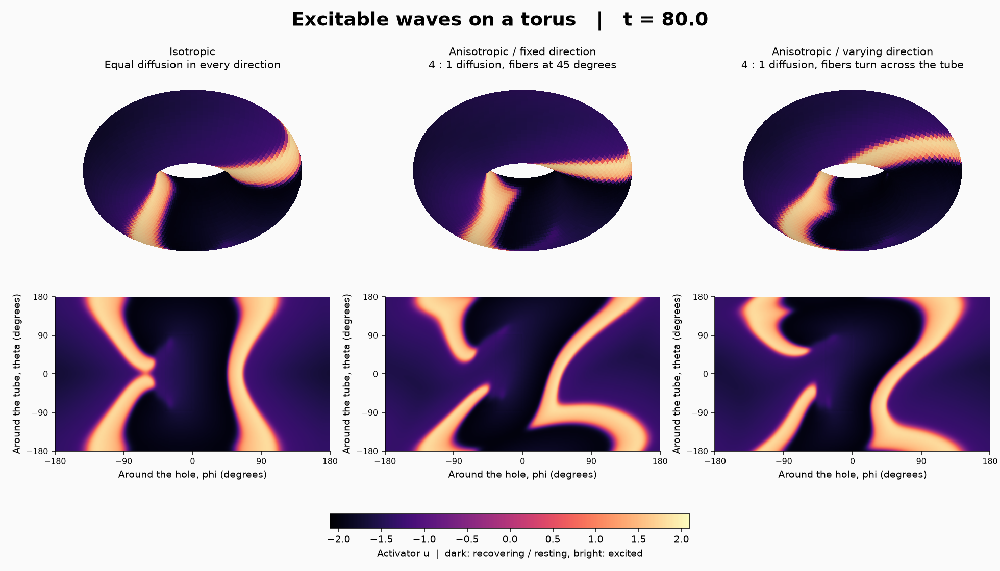

# トーラス上の異方的な興奮波

同じ初期刺激から，方向によって伝わりやすさが異なる興奮波を計算する．
興奮波とは，刺激に反応して周囲に広がり，通過後には回復の時間を要する波である．
化学反応や生体の興奮を簡略化した FitzHugh–Nagumo モデルを使う．
実際の心臓の形状や電気生理を再現するモデルではない．



[比較動画](results/comparison.mp4) ／ [時間ごとの展開図](results/timeline.png) ／
[興奮している面積](results/activity.png) ／ [数値検証結果](results/verification.json)

## 数式とテンソル記法

トーラス（ドーナツ形の曲面）の大半径を12，小半径を6とする．
θは管の断面を回る角度，φは穴の周りを回る角度であり，いずれも周期は2πである．
θ=0はトーラスの外側，θ=πは内側に対応する．距離を表す計量は

\[
g_{ij}=\operatorname{diag}(6^2,(12+6\cos\theta)^2),\qquad
J=\sqrt{\det g}=6(12+6\cos\theta)
\]

となる．興奮の強さをu，回復変数をvとして，

\[
\partial_t u=J^{-1}\partial_i(JD^{ij}\partial_j u)+3u-u^3-v,
\qquad \partial_t v=\varepsilon(u+\beta)
\]

を解く．同じ上下添字について和を取る．β=1.1，ε=0.3であり，
一様な静止状態はu=−β，v=−3β+β³である．初期値としてφ=0付近の
有限な帯を興奮させ，その片側に回復中の帯を置く．外部からの刺激は追加しない．
初期の帯の端が巻き込むことで，曲がった波面や旋回する波が生じる．

伝わりやすい方向を単位接ベクトルnとし，拡散テンソルを

\[
D^{ij}=D_\perp g^{ij}+(D_\parallel-D_\perp)n^i n^j,\qquad
n^i=\left(\frac{\cos\alpha}{6},
\frac{\sin\alpha}{12+6\cos\theta}\right)
\]

とする．gの逆行列g^{ij}と方向ベクトルの積をEgisonの添字記法で組み合わせる．
斜めの方向ではD^{θφ}が0でなく，二つの座標方向の微分が結合する．
座標成分の長さではなくg_{ij}n^i n^j=1で正規化している．

比較する三つの設定は次のとおりである．

| 設定 | D∥ | D⊥ | 方向α |
|---|---:|---:|---|
| isotropic：等方的 | 0.625 | 0.625 | 方向によらない |
| oblique：一定の異方性 | 1 | 0.25 | π/4 |
| twisted：場所で変わる異方性 | 1 | 0.25 | π/4 + 0.75 sin θ |

三例とも拡散テンソルの二つの固有値の平均は0.625である．
角度αは，物理的な接平面でθ方向となす角度である．
twistedの方向場は時間によらず固定されている．

この方程式は非直交座標でも成立する．本例では現行Formuraeの自動計量生成が
対応する直交曲線座標を使う．非直交座標での実装・検証はこの例には含まない．

## 離散化と計算の分担

120×248の格子，時間刻み0.005を標準設定とする．空間には2次精度の
保存形差分，時間には1次精度の陽的Euler法を用いる．
まず各格子面でuの勾配を求める．同じ面に係数と必要な勾配成分を
`resample`（明示的な線形補間）で揃え，テンソルとの積から流束を計算する．
隣り合う面の流束の差を取り，Jで割ってuを更新する．
混合成分を含め，1ステップの参照範囲は各方向に隣の格子点までである．
勾配と流束は`local`で保持する．

JとJD^{ij}は`init`で一度計算し，以後は値を保持する．
時間発展中に計量や方向場の三角関数を再計算しない．
標準設定では64×64のブロックで4ステップをまとめて計算する．
格子数に通信用の余白を加えたサイズがブロック数で割り切れるよう，
`run.py`は格子設定に応じてブロックの大きさを選ぶ．

- `excitable_torus.fme`：初期値，物性，流束，反応，時間更新，面積積分を記述する．
- `driver.c`：Formuraが生成した初期化・更新関数を呼び，結果と集計値を保存する．
  モデルの数値計算や配列への初期値の上書きは行わない．
- `run.py`：パラメータを設定し，`.fme → Egison → .feir → .fmr → Formura → C`
  の通常の経路を順に実行する．
- `render.py`：保存された値の座標変換，色付け，図・動画の描画だけを行う．

全体の面積積分は`.fme`で格子ごとの寄与を計算し，Formuraの`reduces`で合計する．
`mass`は∫u dA，`square`は∫u² dA，`active`はu>0の領域の面積である．
反応がある場合，前二者は保存量ではない．動画は各時刻の数値結果を表示し，
フレーム間の状態を補間していない．

## 再現

Formuraeのルートで実行する．既存のビルド手順でEgison，Formurae，Formuraと
Cコンパイラを用意する．Haskellのビルドと数値実行はすべて直列に実行する．

```sh
# 標準例の生成と短い有界性検査
make excitable_torus

# 三例をt=120まで実行（各24000ステップ）
make excitable_torus-demo

# 描画用ライブラリを専用のPython環境に導入して実行
python3 -m venv .build/excitable_torus/plot-env
.build/excitable_torus/plot-env/bin/pip install numpy matplotlib pillow imageio-ffmpeg
.build/excitable_torus/plot-env/bin/python examples/excitable_torus/render.py --video

# 保存性，空間精度，時間ブロッキング，MPIの確認
make excitable_torus-verify
```

描画ライブラリは数値計算には使わない．ffmpegがPATHにあれば
imageio-ffmpegは不要である．Egisonの場所は`EGISON_DIR`，Formuraの実行ファイルは
`FORMURA`で指定できる．実行入力，生成C，各段階のログ，生の出力，ソースの
ハッシュ値は`.build/excitable_torus/`以下に保存する．再実行時に同じ出力先の
過去のフレームだけを消し，新しい計算結果で置き換える．

MPIで二つのプロセスに分割する例は以下である．mpiccとmpirunを使用する．
`--grid`は全領域の格子数であり，`--mpi`は各方向のプロセス数である．

```sh
python3 examples/excitable_torus/run.py --case twisted --mpi 1 2 \
  --steps 24000 --every 200 --output .build/excitable_torus/mpi-demo
```

`--blocking 0`で時間ブロッキングを無効にできる．出力間隔はブロッキングの
ステップ数の倍数にする．`--param NAME=VALUE`で既存のモデルパラメータを変更できる．
格子を細かくする場合，安定性のため時間刻みも小さくする必要がある．
標準以外のパラメータで同じ波の形や旋回が続くことは保証しない．

このMacのOpen MPI 5.0.9では，起動プログラムがCPU構成の検出中に
`construct_range`で異常終了した．この環境でMPIの動作確認を行う際は，
hwlocに簡略化したCPU構成を渡し，CPUへの固定割当を無効にした．
これはMPIの通信・生成された数値計算をそのまま実行するための起動設定である．
通常の環境でこの指定は不要であり，スクリプトは自動では設定しない．

```sh
HWLOC_SYNTHETIC='node:1 core:10 pu:1' MPIRUN_ARGS='--bind-to none' \
  make excitable_torus-verify
```

設定の意味は[hwlocの公式文書](https://www.open-mpi.org/projects/hwloc/doc/v2.14.0/envvar.html)
を参照．この起動設定での確認は数値結果の一致を対象とし，CPUへの割当を
調整した並列性能測定ではない．

## 数値検証

`verify.py`は本体と同じ生成経路を使う．

1. 反応を止め，三つの拡散テンソルで∫u dAの保存と∫u² dAの減少を確認する．
2. 一様な静止状態が保持されることを確認する．
3. 時間ブロッキングの有無と，二方向それぞれのMPI分割による全格子値を比較する．
4. 滑らかな初期値1+sin θ cos φに対して，曲面上の流束をEgisonで解析的に
   微分した値と，生成された差分による初期変化率を比較する．
   32×64，64×128，128×256の格子で2次の空間収束を確認する．

4の追加定義・初期値・更新式は`accuracy.fme.inc`にある．区切り行`---`で
三つの部分を分け，検証時に本体の対応する位置へ挿入して一つの`.fme`として
通常のコンパイラに渡す．参照値と面積で重み付けした二乗誤差の計算も
このFormuraeソースにあり，Python側には別の差分ソルバーを置かない．
この検査は空間差分の精度を対象とし，長時間の非線形解の収束検査とは異なる．

## 関連研究

- [Kneer, Schöll, Dahlem (2014), Nucleation of reaction-diffusion waves on curved surfaces](https://arxiv.org/abs/1403.1716)：本例で使う形のFitzHugh–Nagumo方程式と，トーラス上の興奮波を扱う．本例の寸法・係数・初期条件は独自のデモ設定である．
- [Dierckx et al. (2013), Drift laws for spiral waves on curved anisotropic surfaces](https://arxiv.org/abs/1301.5469)：曲率・異方性と渦巻き波の移動の関係を扱う．本例ではその移動法則の定量的な再現までは検証していない．
