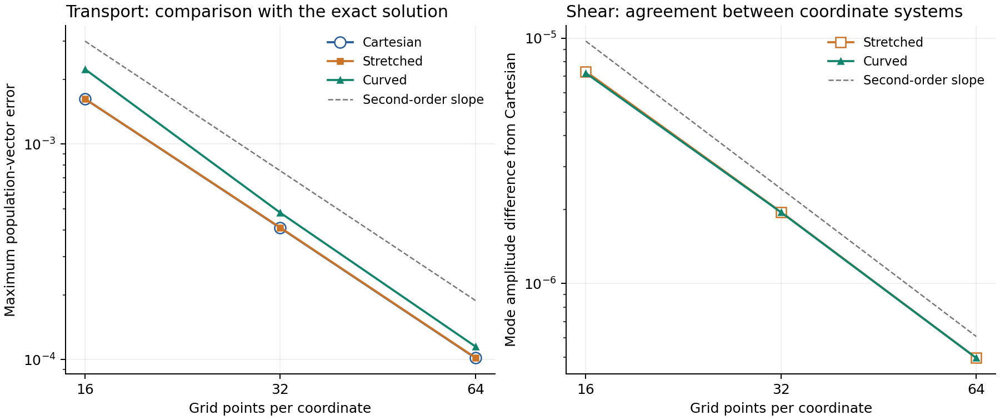

# 座標を変えても同じ流れを表す D2Q9 の検証

二次元・九速度の分布を使う D2Q9 を，分布の移動を微分方程式で解く方法で
記述する．同じ `.fme` の座標写像の係数だけを変え，直交座標，間隔が変わる
直交座標，非直交の曲線座標を比較する．波のモデルを一般座標系に対応させる
ための小規模な検証であり，水面・空気・表面張力はこの例には含めない．

## 方程式と幾何

物理空間は一辺 `2π` の周期的な平面とする．計算用の座標 `x,y` から
物理座標 `X,Y` への写像は，次のとおりである．

```text
X = x + stretch*sin(x) + shear*sin(y)
Y = y
J = 1 + stretch*cos(x)
H = shear*cos(y)
g = [[J², J*H], [J*H, 1+H²]]
```

`J` は面積を換算する係数，`g` は長さ・角度を表す計量である．物理空間で
一定の九速度 `(ex[a],ey[a])` は，計算用の座標では
`c[a] = ((ex[a]-H*ey[a])/J, ey[a])` となる．成分番号 `a` は空間方向の
添字 `i` と区別する．`field f_a` は九個のスカラー量，`c_a~i` は九本の
ベクトルを表す．

固定するのは物理空間の九方向であり，座標を変えた際にはそのベクトル成分を
変換する．九方向という近似そのものが持つ方向依存性は残る．ここで検証する
座標の独立性は，同じ物理的な九方向と方程式を異なる座標で表せることである．
対象は平面の座標変換であり，球面など空間自体が曲がった場合は追加の検討を要する．

更新式は，体積要素を含む保存形

```text
∂t f[a] = -∂i(J*c[a]^i*f[a])/J + (feq[a]-f[a])/tau
```

である．平衡分布 `feq` は，密度と速度から作る通常の二次の式で，速度の
内積には計量を使う．移動は中心差分で計算し，時間積分には三段・三次の
陽的Runge–Kutta法（途中の状態を三回評価する方法）を使う．`tau` は連続時間の
緩和時間であり，隣接点へ直接移す標準LBMの `(tau-0.5)/3` という粘性の式を
そのまま当てはめない．

時間積分は，1物理ステップを生成コードの3回の更新で実行する．開始時の
分布を `original_a` に保存し，`stage` で段階を管理する．`L` を移動と衝突の
右辺とすると，次の三段になる．

```text
f1 = f0 + dt*L(f0)
f2 = 3*f0/4 + (f1 + dt*L(f1))/4
f3 = f0/3 + 2*(f2 + dt*L(f2))/3
```

段階の選択と物理時刻の更新もFMEに書く．C側は3回の更新が終わった時点の
集計結果を出力する．全段階を一つの更新へ展開する試行ではコード生成が重くなったため，
この実験では既存の場に途中の状態を保存する．三段に分けても生成には数分を要する．
中心差分とこの時間積分で検証できる滑らかな小振幅の条件を使っており，
水面の分裂に必要な分布の正値性や高い密度比での安定性は，次の実験で確かめる．

この写像では `J*c[a]^x` が `y` のみに，`J*c[a]^y` が `x` のみに依存する．
そのため一様な分布の流束の発散は，中心差分でも相殺される．任意の写像での
一様流保存まで確認したことにはならない．

| 座標 | stretch | shear |
|---|---:|---:|
| cartesian | 0 | 0 |
| stretched | 0.2 | 0 |
| curved | 0.2 | 0.3 |

## 三種類の実験

1. **一様流**: 密度1，物理的な速度 `(0.03,0.02)` の平衡分布．座標を
   変えても一様な状態を維持するかを，九成分の初期値からの誤差で調べる．
2. **移動の厳密解**: 衝突を無効にして，各分布を
   `w[a]*(1+A*cos(X+2Y-(ex[a]+2ey[a])*t))` と比較する．全九方向の移動を
   含み，`A=0.02`．各点の九成分の誤差の長さをFMEで求め，その最大値を記録する．
3. **せん断流**: 密度1，物理的な速度 `(0,A*sin(X))` の平衡分布から開始し，
   衝突を有効にする．流れが粘性で減衰することと，物理座標で定義した
   `sin(X)` 成分の振幅が座標間で近づくことを調べる．ここで比較するのは
   同じ離散速度の方程式の解であり，Navier–Stokes方程式の厳密解との比較ではない．

各座標で16×16，32×32，64×64点を使う．領域の物理的な大きさは同一であり，
`dt=0.1*dx`，計算時間は `0.8π` とする．格子数だけを変えて物理的な領域や
終了時刻を変える比較はしない．

## 結果（2026-09-17）

3条件×3座標×3格子の27通りが検証を通過した．質量の相対変化の最大値は
`1.95×10⁻¹⁴`，物理的な運動量の絶対変化は `6.35×10⁻¹⁷`，
一様流の分布の誤差は `8.85×10⁻¹⁷` であった．
合格条件は，質量の相対変化と運動量の絶対変化が `2×10⁻¹¹` 未満，
一様流の誤差が `2×10⁻¹²` 未満，移動の誤差とせん断流の座標間の差が
格子を細かくするごとに減少し，最後の収束次数が1.7を超えることとした．

衝突を無効にした移動の，終了時刻での厳密解との最大誤差は次のとおりである．
最後の列は32点から64点へ増やした際の収束次数であり，2に近ければ
格子間隔を半分にすると誤差がおよそ4分の1になる．

| 座標 | 16×16 | 32×32 | 64×64 | 収束次数 |
|---|---:|---:|---:|---:|
| 直交 | 1.622×10⁻³ | 4.089×10⁻⁴ | 1.017×10⁻⁴ | 2.008 |
| 間隔が変わる直交 | 1.624×10⁻³ | 4.101×10⁻⁴ | 1.020×10⁻⁴ | 2.007 |
| 非直交の曲線 | 2.228×10⁻³ | 4.806×10⁻⁴ | 1.150×10⁻⁴ | 2.064 |

粘性で減衰するせん断流では，どの座標でも速度の振幅と運動エネルギーが減少した．
非直交の曲線座標と直交座標との振幅の差は，`7.20×10⁻⁶ → 1.95×10⁻⁶ → 4.96×10⁻⁷`
と減り，最後の収束次数は1.974だった．



左図は厳密解との差，右図は同じ格子数の直交座標との差である．破線は二次精度の
傾きを表す．これにより，この写像と滑らかな初期条件では，座標を変更した同じ更新式が
同じ連続方程式の結果へ近づくことを確認した．任意の写像や二相流の検証は今後行う．

## 実行

リポジトリ直下で次を実行する．すべての生成・ビルド・実行は直列である．

```sh
python3 examples/kinetic_coordinates/run.py
python3 examples/kinetic_coordinates/verify.py
```

まとめて実行するには `make kinetic-coordinates-verify` を使う．
小さい格子から順に確認する場合は，まず `run.py --grids 16`，次に
`run.py --reuse-normalized --grids 32 64`，最後に `verify.py` を実行する．

実行用Pythonは標準ライブラリのみを使用する．結果は
`.build/kinetic_coordinates/` に置き，検証値と各実行の記録を
[`results/verification.json`](results/verification.json) に保存する．
`--reuse-normalized` は，FMEと処理系の入力が同じときだけ正規化結果を再利用する．

幾何・初期条件・移動・衝突・時間積分・物理量・厳密解との誤差はすべて
[`kinetic_coordinates.fme`](kinetic_coordinates.fme) に記述する．Cは生成コードの
呼び出しと集計済みの値の出力，Pythonは生成・起動・記録値の検証を担当する．
通常の `.fme → Egison → FEIR → .fmr → Formura → C` を使う．

C生成は格子サイズごとに1回行い，同じ実行ファイルへ座標と実験の係数を渡す．
生成済みFMRの `param` に対応する定数値だけを `kineticConfig` 呼出しへ置き換え，
既存の `extern` を介して設定値を読む．この関数は受け取った値を返すだけで，
幾何や流体の計算は行わない．検証記録にはFMEのハッシュ，処理系とライブラリの
入力のハッシュ，Egisonの版，Formura実行ファイルのハッシュを含める．

図の再生成だけにMatplotlibを使う．検証後に次を実行するとPNGとSVGを保存する．

```sh
python3 examples/kinetic_coordinates/render.py
```

検証済みの結果を日英のギャラリーへ反映するには，リポジトリ直下で
`make kinetic-coordinates-gallery` を実行する．ソースの変換を再実行して
`.egi`・`.feir`・`.fmr` を保存し，グラフ・検証値・ソース全文を掲載する．
シミュレーションの結果は保存済みの検証JSONから読み，FMEと一致することを確認する．
HTMLだけを更新する場合は `python3 examples/kinetic_coordinates/gallery.py` を使う．
[日本語ギャラリー](../../html/ja/gallery.html#kinetic-coordinates)・
[英語ギャラリー](../../html/en/gallery.html#kinetic-coordinates)から閲覧できる．

添字と計量の変換に関する回帰検査も通過した．再現する場合は直列で実行する．

```sh
sh tests/pre_index_sizes.sh
cabal exec -v0 runghc -- -isrc tests/pre_emit_egison.hs
cabal exec -v0 runghc -- -isrc tests/pre_ambient_metric.hs
cabal exec -v0 runghc -- -isrc tests/pre_geometry_emit.hs
cabal exec -v0 runghc -- -isrc tests/pre_type_check.hs
```

## 構文と処理系について分かったこと

- 成分番号と空間方向の区別，九本の速度，計量による内積は既存構文で記述する．
- 保存形の移動は，体積要素を含む流束全体を差分する既存の `∂` で記述する．
- マクロの引数へ直接添字を付ける代わりに，最初に添字付きの `local` へ
  束縛する．実行時の条件分岐を成分生成関数の中で使う場合は，通常の
  `def` に条件式を置いてから `generateTensor` で呼ぶ．
- `index a : 9` と計量を併用すると，添字の大きさを検査する処理が存在しない
  裸の `g` を参照する不具合を再現した．`g_#_#` または `g~#~#` という
  全成分の参照を選んでから大きさを検査するよう修正した．標準名 `metric` と
  `inverseMetric` も同じ扱いとし，生成Cの回帰検査を追加した．

モデルの中心は次の記述である．下付きの `a` は分布の成分番号，上付きの
`i` は空間のベクトル成分を表す．同じ `i` が上下に現れる積は方向について和を取る．

```formurae
local lower_i = metricLower u
local cu_a = c_a~i . lower_i
local uu = metricNorm u
local equilibrium_a = weights_a*rho*(1+3*cu_a+(9/2)*cu_a^2-(3/2)*uu)
local flux_a~i = volume*c_a~i*state_a
in (0-(∂_i flux_a~i)/volume)+collisionRate*(equilibrium_a-state_a)
```

`metricLower` は `g_i_j` との積で速度の添字を下げ，`metricNorm` は計量による
速度の長さの二乗を求める関数である．`volume` は面積を換算する係数で，
`∂_i` は流束の各成分を対応する座標で微分する．座標写像の係数を変えても，
この部分と時間積分は共通である．

この検証から次に検討するのは，幾何の写像と物理的な方向の共通宣言，保存形の
移動の共通演算子，およびその数値解法の指定である．壁の境界条件，水面の
移動，大きな密度比，表面張力，MPIと時間方向のブロッキングは別途検証する．

## 関連研究

- [Guo and Zhao, Explicit finite-difference lattice Boltzmann method for curvilinear coordinates (2003)](https://doi.org/10.1103/PhysRevE.67.066709)
- [Reyes Barraza and Deiterding, Towards a generalised lattice Boltzmann method for aerodynamic simulations (2020)](https://doi.org/10.1016/j.jocs.2020.101182)

本例は両論文の完全な再実装ではなく，座標を変換した離散速度の方程式を，
Formuraeの既存機能で保存形に記述する実験である．
