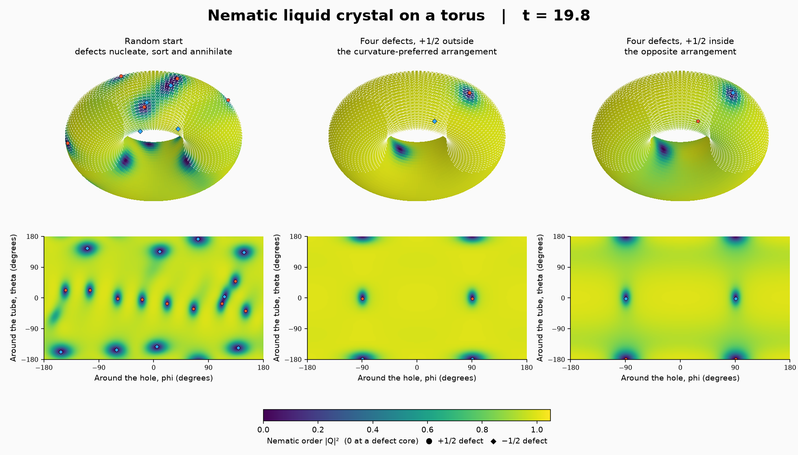

# トーラス上のネマティック液晶：曲率で仕分けられる欠陥

ネマティック液晶は，分子の向きだけがそろい位置は無秩序な液晶である．
向きを表すのに対称でトレース 0 の秩序テンソル Q^{ij}（二次元では独立成分 2 個）を使い，
自由エネルギーを減らす方向へ緩和させる時間発展（Landau–de Gennes の勾配流）を
ドーナツ形の曲面（トーラス）の上で解く．向きの場が半回転する特異点（±1/2 の欠陥）は
対で生まれて対消滅し，その途中で +1/2 は外側（ガウス曲率が正）へ，
−1/2 は穴側（ガウス曲率が負）へ寄る．閉曲面では欠陥の電荷の総和はオイラー標数に等しく，
トーラスでは 0 である．



[比較動画](results/comparison.mp4) ／ [欠陥数・外側の偏り・自由エネルギー](results/defects.png) ／
[数値検証結果](results/verification.json)

## 数式とテンソル記法

トーラスの大半径を R，小半径を r とし，θ は管の断面を，φ は穴の周りを回る角度である．
計量は g_ij = diag(r², (R + r cos θ)²)．反変の秩序テンソル Q^{ij} に対して

\[
\partial_t Q^{ij} = L\, g^{kl}\nabla_k\nabla_l Q^{ij} + \left(a - c\, Q^{mn}Q_{mn}\right) Q^{ij}
\]

を解く．∇ は共変微分（曲がった座標でテンソルを微分するときに，計量の 1 階微分から決まる
接続係数 Γ を足す微分）で，

\[
\nabla_k Q^{ij} = \partial_k Q^{ij} + \Gamma^i_{km} Q^{mj} + \Gamma^j_{km} Q^{im},\qquad
\Gamma^i_{jk} = \tfrac12 g^{il}\left(\partial_j g_{lk} + \partial_k g_{lj} - \partial_l g_{jk}\right)
\]

である．Γ は Egison が計量の記号微分から導き，init で係数場に凍結する．
テンソルの共変ラプラシアンは，各成分の Laplace–Beltrami 作用素と接続項に分けて書く．

```
def gamma unused = withSymbols [i, j, k, l] ((g~i~l . (∂/∂ g_l_k coordinates~j + ∂/∂ g_l_j coordinates~k - ∂/∂ g_j_k coordinates~l)) / 2)
def covTheta Q~a~b = withSymbols [i, j, l] (∂_θ Q~i~j + (christoffel 0)~i_1_l . Q~l~j + (christoffel 0)~j_1_l . Q~i~l)
```

`(christoffel 0)~i_1_l` のように，式の結果へ添字を適用する Egison の記法をそのまま使う
（この記法は今回 Formurae の構造化された式文法にも取り込んだ）．
更新後に Q からトレース部分 g^{ij} g_kl Q^{kl}/2 を引き，トレース 0 を保つ．

初期条件は三種類である．

| 設定 | 初期の向き | 意味 |
|---|---|---|
| random | 滑らかな擬似乱数のベクトル場 (m_x, m_y) の向き | 零点が欠陥になる（標準格子で 28 対） |
| favored | m = (cos φ, sin θ sin φ) | +1/2 が外側，−1/2 が穴側に 2 対 |
| disfavored | m = (cos φ, −sin θ sin φ) | +1/2 が穴側，−1/2 が外側に 2 対 |

m は正規直交枠での「向きを 2 倍した」ベクトル (cos 2α, sin 2α) に比例し，
Q = (S/2)(m_x, m_y; m_y, −m_x)/|m| から座標成分へ直す．

標準設定（120×240 格子，t = 0 → 60）の結果：random では t = 6 に 20 対あった欠陥が t = 60 に 7 対まで減り，
残った +1/2 は 7 個すべてが外側，−1/2 は 7 個すべてが穴側にある（t = 15 の時点で +1/2 は 10/10 が外側，−1/2 は 2/10 が外側）．
favored の 4 欠陥はそのまま残り（自由エネルギー −680），disfavored の 4 欠陥も t = 60 まで残るが自由エネルギーは −629 と高い．
曲率と反対の配置は準安定で，この時間内には入れ替わらない．

## 欠陥の検出

各格子のまわり（四つの格子点を回る閉路）で m の回転数を数える．
m の偏角が −π と π の境（負の x 軸）を横切る回数を符号つきで足すと，
閉路のまわりの回転数が整数で得られる（atan2 を使わない）．
隣の格子点の値は，中心差分と 3 点の 2 階差分から厳密に復元する（LBM の例と同じ恒等式）．
回転数 +1 の格子が +1/2 の欠陥，−1 が −1/2 の欠陥である．
欠陥の個数，外側（cos θ > 0）にある個数，自由エネルギー，|Q|²，トレース，
対称性の残差はすべて `.fme` で計算し，`reduces` で集計する．

## 離散化と計算の分担

- 120×240 の格子，Δt = 0.00375（`make nematic_torus-demo`）とし，時間には 1 次精度の陽的 Euler 法，
  空間には同一格子点配置の中心差分（2 階微分は 3 点）を用いる．
- 各更新の参照範囲は 2 格子点までである（欠陥の回転数を求めるずらし操作のため）．
  4 ステップをまとめる時間ブロッキングと MPI 分割に対応する．
- Egison の正規化は数分かかるので，`run.py` はパラメータ値を除いたソースのハッシュで
  正規化結果を保存し，パラメータ値は生成した Formura プログラムへ差し替える．
- `driver.c` は生成した関数を呼び，Q の成分・|Q|²・回転数を保存する．
- `render.py` は保存した Q から向きの線分を描く（表示用の固有ベクトル計算）．

## 再現

```sh
make nematic_torus            # 標準設定の短い実行
make nematic_torus-demo       # 三つの初期条件を実行
.build/excitable_torus/plot-env/bin/python examples/nematic_torus/render.py --video
make nematic_torus-verify     # 勾配流・対称性・電荷中性・ブロッキング・MPI・空間精度の確認
```

## 数値検証

`verify.py` は本体と同じ生成経路を使う．

1. 自由エネルギーが単調に減少する（勾配流）．Q の対称性は厳密に，トレースは 1e-12 以下に保たれる．
2. +1/2 と −1/2 の個数が常に等しい（トーラスの電荷中性）．
3. 時間ブロッキングの有無と，二方向の MPI 分割で全格子値が一致する（最大差 0）．
4. 滑らかな欠陥のない Q に対して，Egison で解析的に微分した共変ラプラシアンと
   生成された差分の値を比べ，2 次の空間収束を確認する（`accuracy.fme.inc`）．
   面積で重み付けした相対二乗誤差は 32×64，64×128，128×256 の格子で
   2.8e-4，1.7e-5，1.1e-6 と，格子を半分にするごとに 15.8 倍，15.9 倍小さくなる
   （2 次精度なら 16 倍；`results/verification.json`）．

## 関連研究

- Bowick, Nelson, Travesset (2004), Curvature-induced defect unbinding in toroidal geometries, Phys. Rev. E 69, 041102.
- Jesenek, Kralj, Rosso, Virga (2015), Defect unbinding on a toroidal nematic shell, Soft Matter 11, 2434.
- Ellis, Pearce, Chang, Goldsztein, Giomi, Fernandez-Nieves (2018), Curvature-induced defect unbinding and dynamics in active nematic toroids, Nature Physics 14, 85.
