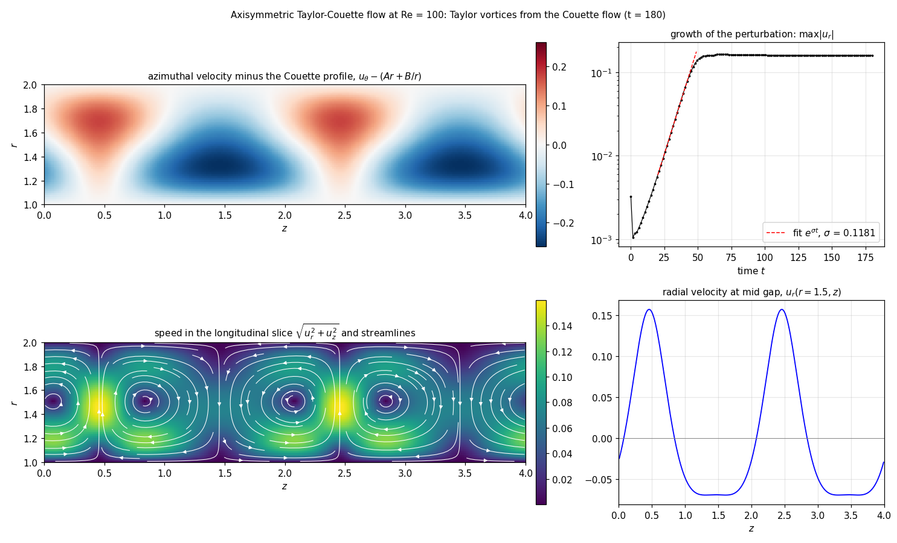

# 軸対称テイラー・クエット流れ：反復回数を固定した射影法の基準版

二つの同軸円筒（内側 $r=R_1=1$ が角速度 $\Omega_1=1$ で回転，外側 $r=R_2=2$ は静止）の
間の非圧縮流れを，子午面 $(r,z)$ の軸対称モデルとして計算する．$z$ は周期的である．
時間発展は圧力補正型の射影法（予測速度を求め，圧力補正のポアソン方程式を解き，
速度を発散のない場に補正する方法）で，ポアソン方程式は**回数を固定した 4 回の
重み付きヤコビ反復を `step` の中に展開**して解く．入れ子の反復構文も全領域集計も使わず，
Formura 本体も変更しない．[TODO/nested-stencil-iteration.md](../../TODO/nested-stencil-iteration.md)
の工程 0（Formura を変えずに作れる基準版）にあたり，将来の `iterate` 版と比較する基準になる．

## 方程式と離散化

未知量は速度 $(u_r,u_\theta,u_z)$ と密度で割った圧力 $p$ で，円筒座標の軸対称
ナビエ・ストークス方程式を流束形で書く．配置はスタッガード格子（MAC 配置）である．

| 量 | 宣言 | 位置 |
|---|---|---|
| $u_r$ | `u_1`（`field u_i @ dual` の第 1 成分） | $r$ 面（$r$ は整数点，$z$ は半整数点） |
| $u_z$ | `u_2` | $z$ 面（$r$ は半整数点，$z$ は整数点） |
| $u_\theta$，$p$ | `ut`，`p`（`scalar @ dual`） | セル中心（両方向とも半整数点） |

一時間ステップは，予測速度 $u^\ast$，右辺 $\mathrm{rhs}=\mathrm{div}_h u^\ast/\Delta t$，
$\varphi_0=0$ からの 4 回のヤコビ反復 $\varphi_{k+1}=\varphi_k+\omega(\mathrm{rhs}-L_h\varphi_k)/D$，
補正 $u'=u^\ast-\Delta t\,\mathrm{grad}_h\varphi_4$，$p'=p+\varphi_4$ からなる．
$L_h=\mathrm{div}_h\circ\mathrm{grad}_h$ は発散と勾配を同じ離散演算子で合成するので，
恒等式 $\mathrm{div}_h u'=\Delta t\,(\mathrm{rhs}-L_h\varphi_4)$ が丸め誤差の範囲で成り立つ．
この右辺（ポアソン方程式の残差）を状態の場 `res`，左辺を `dv` として保存し，YAML の
`reduces` で最大値を C 側へ渡す．

すべての流束は自分の配置を持つ `local` として実体化し，一度だけ差分する．
半径方向の流束は面の半径 $r$ を重みとして持ち，円筒座標の発散
$\frac1r\partial_r(r\,\cdot)+\partial_z(\cdot)$ を保存形で実現する．
配置の違う量の積は `resample` で明示的に補間する．

## 壁の扱い

YAML の `boundary: [fixed 0.0, periodic]` により，$r$ 方向のゴースト値はすべて 0 である．
内壁は面 0，外壁は面 `total_grid_r - 1` で，どちらも格納される格子点である
（`length_per_node` は $(R_2-R_1)N/(N-1)$，33 点で $\Delta r=1/32$）．外壁の外側にある
最後のセル中心の格子点は `cmask` で常に 0 に固定し，内壁のゴーストと同じ役割をさせる．
壁の条件は更新式の中に書く．

- 法線速度 $u_r$ は両方の壁面で 0 に固定する（`fmask`）．
- $u_\theta$，$u_z$ の粘性流束は，壁面で壁速度に対する片側差分を使う．隣の値が 0 なので
  $2\,\partial_r u-2U_{\mathrm{wall}}/\Delta r$（内壁；外壁は符号が逆）と書ける（`wfac`，`wlo`，`whi`）．
- 圧力補正の壁面を通る流束は 0 にする（斉次ノイマン条件）．

ゴースト格子点では生成コードの座標が格子を一周して折り返すため，モデルはゴースト格子点で
読んだ座標に依存しない（壁面をすべて格納される格子点に置いた理由である）．

## 検証

```sh
make taylor_couette
```

`tc_check.c` は静止状態から 15000 ステップ（$t=30$，粘性時間 $d^2/\nu=10$ の 3 倍）進め，
次を確かめる．

1. $z$ 平均した $u_\theta$ が層流クエット解 $Ar+B/r$ に一致する（最大誤差 $3\times10^{-4}$，
   $\Delta r^2$ 程度）．
2. 圧力が遠心力とつり合う：$p(r)-p(r_0)$ が
   $P(r)=A^2r^2/2+2AB\ln r-B^2/(2r^2)$ の差に一致する（範囲に対して $9\times10^{-4}$）．
3. 射影の恒等式 `dv = dt * res` が丸め誤差（$10^{-31}$）で成り立つ．
4. 定常状態で発散と子午面速度が消える（$10^{-17}$）．

## デモ：クエット流れから育つテイラー渦

```sh
make taylor_couette-demo
```

`run.py` が Re $=\Omega_1R_1(R_2-R_1)/\nu=100$，$L_z=4$，65×256 格子（$\Delta r=\Delta z=1/64$），
$\Delta t=0.003$ の構成を生成し，層流クエット解とその遠心力の圧力から出発して，半径方向速度に
最初の四つの軸方向周期を種にした振幅 $10^{-3}$ の擾乱を加え，$z$ 方向を 4 つの MPI ランクに分けて
6 万ステップ（$t=180$）進める．続いて閾値を挟む二つの粗い格子（33×128）の実行，Re $=60$ と
Re $=80$ を行い，`render.py` が図 `results/taylor-couette-{en,ja}.png`，動画 `results/taylor-couette-{en,ja}.mp4`
（`ffmpeg` が必要）と記録 `results/runs.json` を書く．

動画の左側は，立てた円筒の手前の 1/4 を切り開き，外側の斜め上から見る立体図である．
保存済みの軸対称な速度場を円筒座標から立体に描き直し，二つの切り口に子午面（円筒の軸を含む
縦断面）の速さと流線を表示する．内筒の縦の印は角速度 $\Omega_1=1$ で回転し，隙間の白い矢印は半径 1.28，1.70，
高さ $L_z/8,3L_z/8,5L_z/8,7L_z/8$ の周方向速度を示す．上下の端は周期的な計算領域の
表示範囲であり，蓋は置かない．立体図の色尺度は右下の縦断面と共通である．

中央は $z=L_z/8=0.5$ の断面を $+z$ 側から見た図で，内筒の印が反時計回りに回転し，
外筒の印は静止する．流体部分の色は周方向速度 $u_\theta$，動く白い矢印は固定した半径と
$z$ における角速度 $u_\theta/r$ を示す．矢印は半径方向・軸方向に移動する流体粒子の軌跡ではない．
右側は子午面の周方向速度とクエット解の差（上），および子午面の速さと
流線（下）で，破線が中央図の断面位置を示す．

500 ステップ（時間 1.5）ごとに保存された速度を描画用に線形補間し，計算時間の 6 倍速，
30 fps，1920×960 の約 30 秒の動画にする．矢印の角度は補間した角速度に従って動かす．
内筒の回転が逆向きに見えないよう，1 コマあたりの回転角が十分小さいことを確認する．
右側の色尺度は最終状態に固定し，流線の形は最も近い保存時刻の速度で描く．
保存済みデータから図と動画だけを作り直すには，次を実行する．

```sh
make taylor_couette-render
```

フレームレートと再生速度は `render.py` の `--fps` と `--time-scale` で変更できる．



| 量 | 値 |
|---|---|
| Re $=100$ の擾乱の成長率 $\sigma$（$\max\lvert u_r\rvert\propto e^{\sigma t}$） | 0.118 |
| 飽和した $\max\lvert u_r\rvert$ | 0.160 |
| 軸方向の波長 | 2.0（隙間幅の 2 倍，渦 2 対） |
| Re $=60$ の減衰率（33×128） | −0.053 |
| Re $=80$ の成長率（33×128） | 0.050 |
| 4 ランクでの実行時間（6 万ステップ，500 ステップごとに記録） | 339 秒 |

半径比 $R_1/R_2=1/2$，外筒静止のテイラー・クエット流れの臨界レイノルズ数は約 68 で，
Re $=60$ の減衰と Re $=80$ の成長がこれを挟む．飽和状態の軸方向波長は隙間幅の 2 倍で，
臨界波数 $k_c\approx3.16/d$ から期待される値である．

macOS の Open MPI は起動時のトポロジ検出で落ちることがあるので，`run.py` は
`HWLOC_SYNTHETIC` が未設定なら `node:1 core:10 pu:1` を与える．

## 外側の時間方向ブロッキング

`step` は全領域集計もデータ依存の制御も含まないので，fork の時間方向ブロッキングは YAML に
`grid_per_block` と `temporal_blocking_interval` を書くだけで適用でき，結果は最後の桁まで
一致する．ただし一ステップの参照半径が `Ns = 6` と広いため，一プロセスでは担当領域の
外側の冗長計算が支配的で，間隔 1，2，4 で実行時間は 1.22，1.43，1.95 倍になる
（129×128 格子，1000 ステップ，dt = 10⁻⁴）．詳細は設計書の工程 0 の表を参照．

## 制約

ヤコビ反復の回数 $K$ を増やすと，`step` の依存関係の深さに対して Formura の C 生成時間が
指数的に増える（$K=1,2,4$ でそれぞれ 0.3 秒，1.7 秒，83 秒，$K=8$ は 15 分で打ち切り）．
参照半径（`Ns`）も $K$ に比例して広がる（$K=4$ で 6）．収束判定つきの多数回反復は
この書き方では扱えず，入れ子の反復構文が必要になる．
