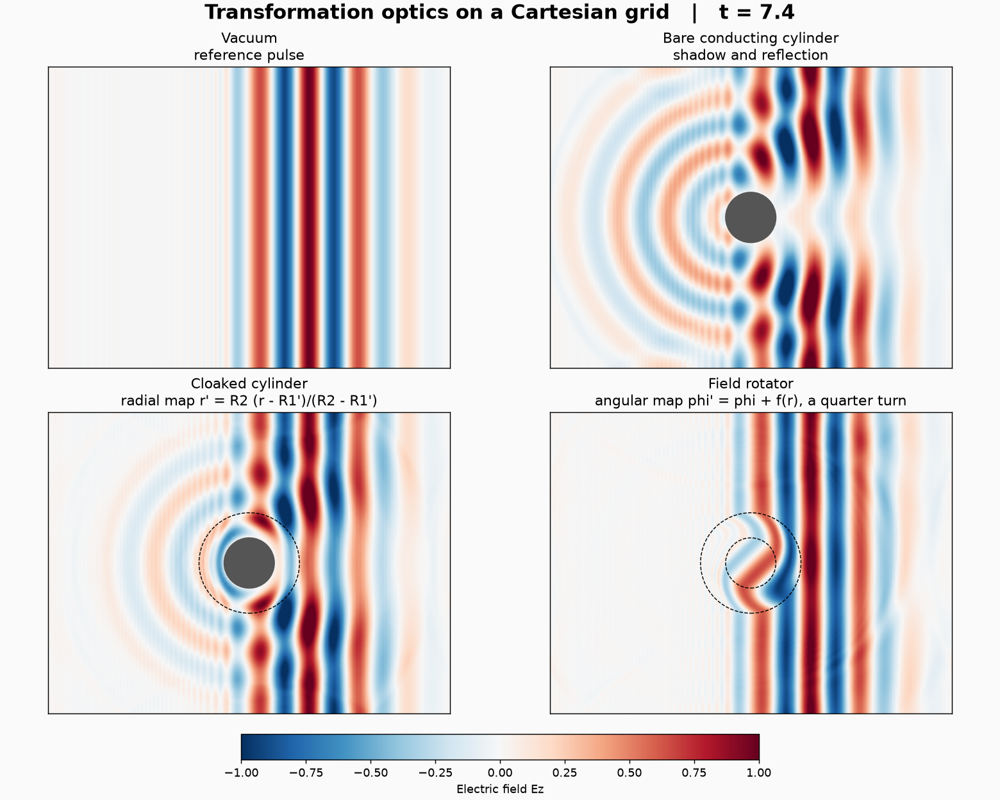

# 座標変換を物質に読み替える波動計算（変換光学）

Maxwell 方程式は一般座標で共変である．平面の座標変換 x' = F(x) を施すと，
変換後の空間で真空だった方程式は，元の直交格子の上では
「異方的な透磁率・誘電率をもつ物質中の方程式」と同じ形になる（Ward と Pendry の対応）．
本例はこの対応を使い，直交格子の Yee 格子（電場と磁場を半セルずらす FDTD 配置）で，
二種類の装置を計算する．

- **クローク**：半径 R1 の導体円柱を，環 R1 < r < R2 の物質で覆い，外から見えなくする．
  写像は r' = R2 (r − R1')/(R2 − R1')（R1' < R1 として物性値を有限に保つ打ち切り版）．
- **場の回転子**：環の中で角度を φ' = φ + f(r) だけずらす写像．内側（r < R1）では
  波面が一定角度だけ回転し，外側は無変化に見える（Chen と Chan）．



[比較動画](results/comparison.mp4) ／ [散乱エネルギーの時間変化](results/scattering.png) ／
[数値検証結果](results/verification.json)

## 数式とテンソル記法

面外電場 E_z と面内磁場 (B_x, B_y) の二次元問題を解く（c = 1）．

\[
\partial_t E_z = \frac{1}{\varepsilon_z}\left(\partial_x H_y - \partial_y H_x\right),\qquad
\partial_t B_i = -(\nabla\times E)_i,\qquad
H_i = (\mu^{-1})_{ij} B_j
\]

座標変換の引き戻し計量を g_ij とすると，直交格子上の物質は

\[
\mu^{ij} = \sqrt{g}\, g^{ij},\qquad \varepsilon_z = \sqrt{g},\qquad
(\mu^{-1})_{ij} = g_{ij}/\sqrt{g}
\]

である．本例では写像そのものだけを書き，物質テンソルは Egison が導く．

```
def rotated unused = [| cx + u 0 * cos (angle 0) - v 0 * sin (angle 0), cy + u 0 * sin (angle 0) + v 0 * cos (angle 0), z |]
def rotatedJacobian unused = withSymbols [k, i] (∂/∂ (rotated 0)~k coordinates~i)
def rotatedMetric unused = withSymbols [i, j, k] ((rotatedJacobian 0)~k_i . (rotatedJacobian 0)_k_j)
def rotatorMaterial unused = withSymbols [i, j] (shell 0 * (rotatedMetric 0)~i~j + (1 - shell 0) * g~i~j)
```

回転子は物理平面の点を，中心のまわりに角 twist (R2 − r)/(R2 − R1) だけ回した点へ送る写像，
クロークは半径を r' = R2 (r − R1')/(R2 − R1') へ伸ばす写像である．`∂/∂` が写像を微分して
Jacobian J^k_i を作り，添字記法の縮約 J^k_i J^k_j が引き戻し計量になる．
手で書くのは体積要素 √g だけである（回転子は 1，クロークは h' r'/r）．det g はこの 2 乗に
正規化されるが，CAS は平方根を含む完全平方の根を取らないので，ここは閉じた式を与える．
中心をずらした座標 x − cx, y − cy は backquote で原子として扱う（展開すると微分に数分かかる）．
二つの装置の計量は別々の場 `Mrot`, `Mcloak` に凍結し，step で旗 `rotator`, `cloak` により選ぶ
（正規化の途中で二つの写像の式が混ざらないようにするため）．
Yee 配置では H_x と B_y が別の位置にあるため，`resample`（明示的な線形補間）で
同じ位置へそろえてから (μ⁻¹)_ij と縮約する．

| 設定 | 装置 | 散乱率（t = 10） | 電磁エネルギーの変動 |
|---|---|---:|---:|
| vacuum | なし | 1e-32（機械精度） | 1.6e-4 |
| obstacle | 裸の導体円柱 | 0.44 | 1.3e-3 |
| cloak | 打ち切りクローク（R1' = 0.9 R1） | 0.15 | 7e-4 |
| rotator | 四分の一回転の回転子 | 0.009 | 6e-4 |

初期パルスの裾は導体の内部には置かない（E_z = 0 に固定された領域に値が残ると，
その勾配が境界の磁場を時間に比例して増やしてしまう）．R1' を 0.95 R1 にしても
クロークの散乱率は 0.14 とほとんど変わらず，残る散乱は打ち切りより空間解像度によるものである．

散乱率は，装置の外側 r > R2 + 0.5 で計算した ∫(E_z − E_z^vac)² dA / ∫(E_z^vac)² dA である．
真空の参照解 E_z^vac は同じプログラムの中で同時に時間発展させ，
差の積分は生成したソルバー内で計算する（`reduces`）．

## 離散化と計算の分担

- 波長 λ = 2，パルス幅 3，格子 320×240（1 波長あたり 40 格子），Δt = 0.1 Δx．
- Yee 格子の配置は，z 方向を 4 格子のダミー周期軸として 3 次元 `curl` にまかせる．
  電場を双対格子（`@ dual`），磁場 B, H を主格子（`@ primal`）に置く．
  磁場の更新 H = μ⁻¹B は新しい B を隣の辺へ補間し，その B は新しい E を，E は H を参照するので，
  一つの更新は前向きに 2 格子，後ろ向きに 1 格子を読む．Formura は前向きの到達距離で袖幅を決めるため
  （逆の配置では後ろ向きが 2 になり，ブロッキングと MPI の値が 5e-4 ずれる；[UPSTREAM.md](../../UPSTREAM.md)），
  この配置で袖幅 2 が正しく取られる．
  4 ステップの時間ブロッキングではダミー軸に 16 層が必要になり，生成コードの静的配列も大きくなる
  （160×120×16 で 0.8 GB，320×240×16 では 2.5 GB となり macOS のローダが読み込めない）ため，
  標準設定ではブロッキングを使わず，ブロッキング有りと MPI 分割の実行は 160×120 の検証で全格子値の一致を確認する．
- 磁場 H = μ⁻¹B を場として保持し，E の更新が B の補間を経由しないようにする．
- 1/ε_z は E_z と同じ位置に置く（双対ベクトル場の第 3 成分 `ie_3`）．節点の値を補間すると
  導体の境界がぼやけ，エネルギーの変動が 1e-2 まで増える．装置の中心は格子点・辺・セル中心の
  いずれからも 1/4 格子ずらし，枠ベクトル (x − cx)/r が r = 0 で評価されないようにする．
- 散乱場の二乗は差 `local diff` を作ってから取る．Egison の正規化は (E − E^vac)² を展開するので，
  展開したままでは真空の散乱率が桁落ち（1e-17）で決まってしまう．
- `driver.c` は生成された初期化・更新関数を呼び，E_z と参照解を保存する．
- `run.py` は装置の選択と格子設定を行い，通常の経路 `.fme → Egison → .feir → .fmr → Formura → C` を実行する．
- `render.py` は保存された値の描画だけを行う．

## 再現

```sh
make transformation_optics           # 標準設定を短く実行
make transformation_optics-demo      # 四つの場合を t = 10 まで実行
.build/excitable_torus/plot-env/bin/python examples/transformation_optics/render.py --video
make transformation_optics-verify    # 散乱率・エネルギー・ブロッキング・MPI・解像度依存の確認
```

描画には numpy と matplotlib（動画には ffmpeg または imageio-ffmpeg）が必要である．

## 数値検証

`verify.py` は本体と同じ生成経路を使う．

1. 真空では散乱率が機械精度で 0，電磁エネルギーが保存される．
2. 裸の円柱の散乱率に対して，クロークと回転子の散乱率が十分小さい．
3. 回転子の散乱率は格子を細かくすると減少する．
4. 時間ブロッキングの有無，MPI 分割（二方向）で全格子値が一致する．

半回転（f(R1) = π/2）の回転子は物性値の異方性が極端になり（固有値比が 100 を超える），
1 波長 40 格子では残留散乱が 2 割程度に残る．本例の標準設定が四分の一回転なのはこのためである．

## 関連研究

- Pendry, Schurig, Smith (2006), Controlling electromagnetic fields, Science 312, 1780.
- Ward, Pendry (1996), Refraction and geometry in Maxwell's equations, J. Mod. Opt. 43, 773.
- Chen, Chan (2007), Transformation media that rotate electromagnetic fields, Appl. Phys. Lett. 90, 241105.
- Zhao, Argyropoulos, Hao (2008), Full-wave finite-difference time-domain simulation of electromagnetic cloaking structures, Opt. Express 16, 6717.
