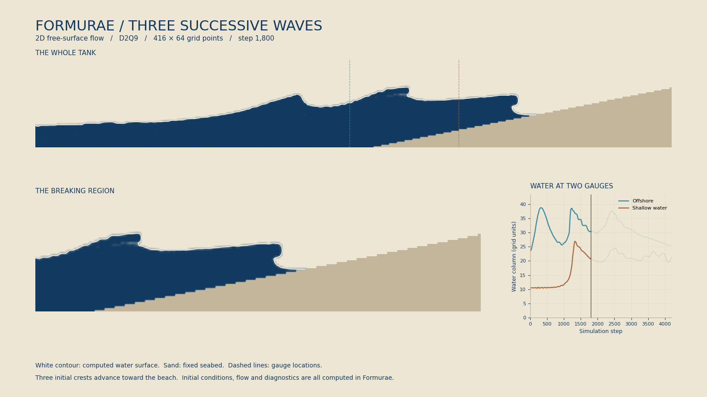

# 連続する3つの波

横から見た二次元の水槽で，3つの波が浅瀬へ進み，波頭が前へせり出し，
崩れた流れが岸へ乗り上げる過程を計算する．
[単一波の例](../breaking_wave/README.md)をもとに，長い水槽，3つの初期波，
2地点の水量計測，砕けた後までの計算を追加した．



[動画（17.6秒）](results/wave-train.mp4) · [時間変化](results/sequence.png) ·
[Formuraeソース](wave_train.fme)

416×64点で4,200ステップを実行した．沖側の観測では320，1,220，2,420ステップ，
浅瀬では1,340，2,520，3,660ステップに3つの波の山を検出し，最後の山の下降まで記録した．
水量の最大相対変化は1.18×10⁻¹⁴である．水面の輪郭と水量保存の確認に加え，
静水と1波だけの比較計算でも，観測された山がそれぞれ0個・1個になることを確認した．

| 記録 | 3波の計算 |
| --- | ---: |
| 水量の最大相対変化 | 1.18×10⁻¹⁴ |
| 1点あたりの保留質量の最大値（全期間） | 0.00692 |
| 1点あたりの保留質量の最大値（終了時） | 4.63×10⁻¹³ |
| 浅瀬で覆いかぶさる水面の指標の最大値 | 40点 |
| 沖側・浅瀬の観測で数えた波の山 | 各3個 |

## 初期条件と計算法

最初から水槽に3つの盛り上がりを置き，右向きの流れを与える．
波を時間差で注入する造波装置ではなく，空間的に離した波の列である．
先行する波によって水深と流れが変わり，後続の波はその水面へ進む．
3波が同じ形で砕けるとは限らない．

水面の初期形状は，平水面の高さに3個の `1/cosh²` 型の盛り上がりを加えたものとする．
厳密な進行波解ではなく，波頭が崩れる条件を調べるための初期条件である．
波の幅・高さ・間隔と右向き速度は `wave_train.fme` のパラメータで指定する．

- 格子は416×64点，平水面の高さ24，波高17.5，幅12，波の間隔70．
- 初期の波の中心は，進行方向の先頭から180，110，40．
- 海底は高さ2から始まり，`x = 215` より右で傾斜0.2となる．
- 重力加速度は0.0001，緩和時間 `tau = 0.58`，初期速度の係数は2.5．
- 4,200ステップまで計算し，20ステップごとに記録する．格子間隔と時間刻みを1とする単位系であり，実際のメートル・秒への換算は行っていない．

格子ボルツマン法（格子点間を移動する分布から流れを求める方法）の二次元・九速度モデル
D2Q9を使う．`dimension 2` と `index a : 9` により，2次元の空間と9成分の分布
`f_a` を別々に宣言する．各格子点を水・水面・空気・固体に分け，水の占有率
（格子点を水が占める割合）と質量を追跡する．水面の高さを1つに限定しないため，
波頭の下に空間ができる形も表現できる．アルゴリズムと参考文献は
[単一波の計算法](../breaking_wave/README.md#計算法)を参照されたい．

初期条件，海底，壁，衝突・移動，水面の分類，質量の再配分，検証用の場は
すべて `wave_train.fme` にある．物理的な1ステップは5回の生成された更新で実行する．
Cは生成関数の呼び出しと出力・検査，Pythonはビルド・起動・ファイル操作・
記録値の比較・描画を担当する．Formura本体の拡張や外部の流体ソルバーは使わない．

## 記録と検証

`gaugeOffshoreX = 205` と `gaugeSurfX = 275` の2本の鉛直列で，
水の占有率の合計をFormuraeで求める．これはその列に含まれる水の量であり，
波頭が折り重なるときに単一の水面高さとみなすことはできない．
動画の破線が観測位置，右下のグラフが記録値である．

`verify.py` は保存済みの記録を比較し，上昇後に十分下がった山を数える．
上昇と下降がいずれも2格子分以上の山だけを採用するため，小さな振動は数えない．
波の数や到達時刻を先に固定した検出ではなく，検出された山がそれぞれ3個あることと，
各波の浅瀬への到達が沖側より後であることを検査する．
最後の山も下降まで記録されている必要がある．

水量は，各点の質量と一時的な保留量 `bank` の総和で検査する．
水面の分類が変わった際に近傍の受け取り手がなくなると，余剰質量を `bank` に残し，
後のステップで再配分する．したがって水量保存だけで精度が保証されるわけではない．
全期間の保留量と終了時の残量を別々に報告する．検査条件は次のとおりである．

- 水量の相対変化が10⁻⁹未満で，すべての記録値が有限．
- 密度は0.5より大きく1.5未満，流速は0.3未満．
- 1点あたりの保留量は0.1未満（基準密度の水で満たした1点の質量の10%），終了時は10⁻⁶未満．
- 浅瀬で覆いかぶさる水面が生じ，最初は乾いていた斜面にも水が到達する．
- 静水では流速0.001未満，覆いかぶさりなし．1波だけの比較では両観測点の山も1個となる．

覆いかぶさりの指標は，水の占有率が0.5を超え，直下の点が0.5未満で，
直下が固体でない点の数である．飛び離れた水滴も含まれるため，
この指標だけから巻き波型砕波を断定しない．波頭の形と崩れる様子は動画でも確認する．

静水1,200ステップの最大流速は0.0001544，水量の最大相対変化は1.18×10⁻¹⁴であった．
1波だけの4,200ステップの比較では，両観測点に山が1個あり，
水量の最大相対変化は6.61×10⁻¹⁵であった．比較計算の設定と記録も
[静水](results/still/metadata.json)・[1波](results/single/metadata.json) に保存した．

結果は [verification.json](results/verification.json)，全記録は
[stats.csv](results/stats.csv)，設定とソースのSHA-256は
[metadata.json](results/metadata.json) に保存する．

## 再現

Formurae本体の環境に加え，描画にはNumPy，Matplotlib，ffmpegを使う．
リポジトリ直下で次を実行する．

```sh
make wave-train-demo
make wave-train-verify
```

通常の `.fme → Egison → FEIR → .fmr → Formura → C` の経路で生成・実行し，
生の計算結果を `.build/wave_train/demo/` に保存する．FEIRはFormuraeの中間表現である．
描画用の補間と色付けだけを `render.py` で行い，水面の巻き込みや泡を描き足さない．
白線は保存した占有率0.5の等高線である．

個別に実行する場合は次のとおりである．最初の正規化結果は，ソースと処理系の
入力のハッシュを用いてキャッシュする．数値パラメータだけの変更では，正規化済みの
Formuraプログラムに値を設定し直す．

```sh
python3 examples/wave_train/run.py
python3 examples/wave_train/verify.py --reference-cases
python3 examples/wave_train/render.py --snapshot-step 1800 \
  --sequence-steps 0 1200 1800 2400 3200 4200
```

`waveCount=1` または `2` で初期波を減らせる．観測位置は整数の格子座標を指定する．
波間隔を変える場合は，3つの中心が水槽内に収まるように `center` と格子幅も調整する．

## 適用範囲

空気は一定圧力として扱い，空気の流れ，閉じ込められた気泡の圧縮，表面張力は計算しない．
海底は格子に沿った階段状の壁である．細かな白波や飛沫の定量的な再現，
実験との比較，格子を細かくした際の誤差評価はまだ行っていない．
閉じた水槽なので，さらに長く計算すると反射や戻る流れが波に影響する．

今回の作業では粘性を下げた条件も試したが，長時間計算で流速の検査範囲を外れたため
掲載条件には採用していない．624×96点へ細かくした試行も，4,410ステップで
流速0.30064となって検査を通らなかった．孤立した小さな水の部分の取り扱いを
改善する必要があり，この結果を解像度による精度向上の証拠には用いない．
再現条件と対策の課題は [自由表面の長時間計算](../../TODO/free-surface-long-runs.md) に記録した．
パラメータや計算時間を変える場合も，
動画の見た目だけでなく `verify.py` の検査を併用する．
